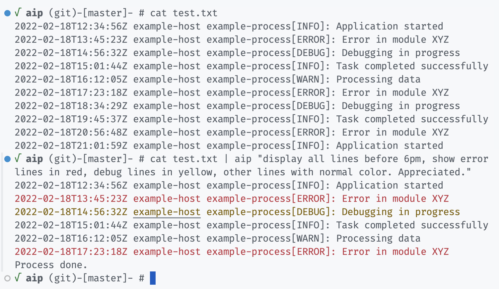

# aip

cli tool to process lines from stdin using natural language (openai)

## Examples

        √ aip (git)-[main]- # cat test.txt | aip "add line numbers starting to count from 5"
        5 2022-02-18T12:34:56Z example-host example-process[INFO]: Application started
        6 2022-02-18T13:45:23Z example-host example-process[ERROR]: Error in module XYZ
        7 2022-02-18T14:56:32Z example-host example-process[DEBUG]: Debugging in progress
        8 2022-02-18T15:01:44Z example-host example-process[INFO]: Task completed successfully
        9 2022-02-18T16:12:05Z example-host example-process[WARN]: Processing data
        10 2022-02-18T17:23:18Z example-host example-process[ERROR]: Error in module XYZ
        11 2022-02-18T18:34:29Z example-host example-process[DEBUG]: Debugging in progress
        12 2022-02-18T19:45:37Z example-host example-process[INFO]: Task completed successfully
        13 2022-02-18T20:56:48Z example-host example-process[ERROR]: Error in module XYZ
        14 2022-02-18T21:01:59Z example-host example-process[INFO]: Application started

        √ aip (git)-[main]- # ifconfig -a | aip "show interfaces and ips"     
        lo0: 127.0.0.1
        en0: 192.168.1.3
        utun4: 192.168.44.23
        bridge100: 192.168.69.1

